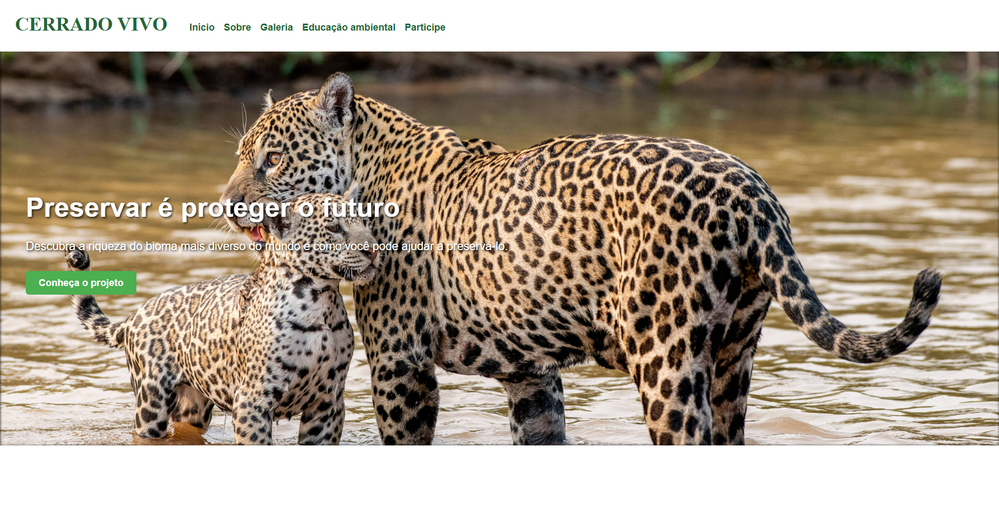

# Projeto Cerrado 🌿

Meu primeiro projeto acadêmico que desenvolvi com HTML e CSS, focado em conteúdos sobre o bioma Cerrado. 

## Tecnologias usadas:
- HTML5
- CSS3

## O que aprendi:
- Organização de conteúdo em múltiplas páginas
- Responsividade do conteúdo através das Media queries.
- Estilização com CSS básico e intermediário
## Preview

📁 Acesse o projeto clicando [aqui](https://alvarenga-io.github.io/projeto-cerrado/index.html).
